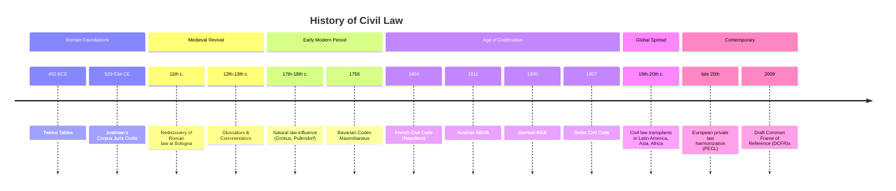

```mermaid
timeline
    title History of Civil Law
    section Roman Foundations
      450 BCE : Twelve Tables
      529‑534 CE : Justinian's<br>Corpus Juris Civilis
    section Medieval Revival
      11th c. : Rediscovery of Roman<br>law at Bologna
      12th‑13th c. : Glossators &<br>Commentators
    section Early Modern Period
      17th‑18th c. : Natural law influence<br>(Grotius, Pufendorf)
      1756 : Bavarian Codex Maximilianeus
    section Age of Codification
      1804 : French Civil Code<br>(Napoléon)
      1811 : Austrian ABGB
      1900 : German BGB
      1907 : Swiss Civil Code
    section Global Spread
      19th‑20th c. : Civil law transplants<br>in Latin America, Asia, Africa
    section Contemporary
      late 20th : European private law<br>harmonization (PECL)
      2009 : Draft Common Frame of<br>Reference (DCFR)s
```
