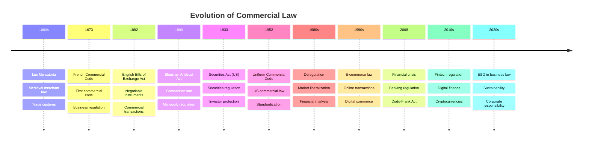

```mermaid
timeline
    title Evolution of Commercial Law
    1000s : Lex Mercatoria
          : Medieval merchant law
          : Trade customs
    1673 : French Commercial Code
          : First commercial code
          : Business regulation
    1882 : English Bills of Exchange Act
          : Negotiable instruments
          : Commercial transactions
    1890 : Sherman Antitrust Act
          : Competition law
          : Monopoly regulation
    1933 : Securities Act (US)
          : Securities regulation
          : Investor protection
    1952 : Uniform Commercial Code
          : US commercial law
          : Standardization
    1980s : Deregulation
          : Market liberalization
          : Financial markets
    1990s : E-commerce law
          : Online transactions
          : Digital commerce
    2008 : Financial crisis
          : Banking regulation
          : Dodd-Frank Act
    2010s : Fintech regulation
          : Digital finance
          : Cryptocurrencies
    2020s : ESG in business law
          : Sustainability
          : Corporate responsibility
```
