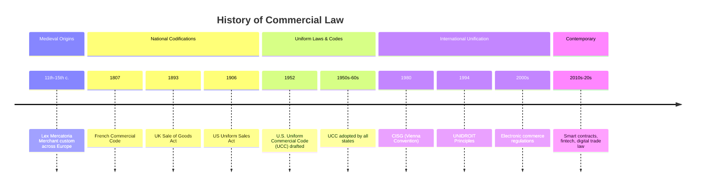

```mermaid
timeline
    title History of Commercial Law
    section Medieval Origins
      11th‑15th c. : Lex Mercatoria<br>Merchant custom across Europe
    section National Codifications
      1807 : French Commercial Code
      1893 : UK Sale of Goods Act
      1906 : US Uniform Sales Act
    section Uniform Laws & Codes
      1952 : U.S. Uniform Commercial Code<br>(UCC) drafted
      1950s‑60s : UCC adopted by all states
    section International Unification
      1980 : CISG (Vienna Convention)
      1994 : UNIDROIT Principles
      2000s : Electronic commerce<br>regulations
    section Contemporary
      2010s‑20s : Smart contracts,<br>fintech, digital trade law
```
