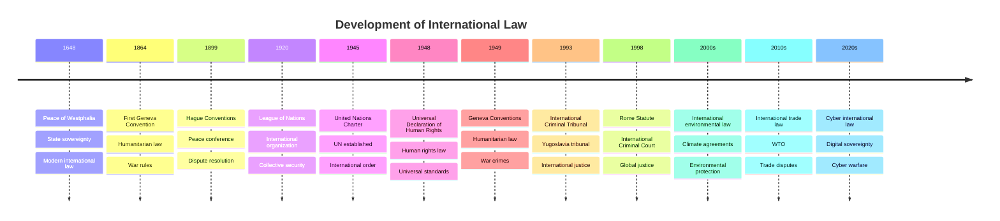

```mermaid
timeline
    title Development of International Law
    1648 : Peace of Westphalia
          : State sovereignty
          : Modern international law
    1864 : First Geneva Convention
          : Humanitarian law
          : War rules
    1899 : Hague Conventions
          : Peace conference
          : Dispute resolution
    1920 : League of Nations
          : International organization
          : Collective security
    1945 : United Nations Charter
          : UN established
          : International order
    1948 : Universal Declaration of Human Rights
          : Human rights law
          : Universal standards
    1949 : Geneva Conventions
          : Humanitarian law
          : War crimes
    1993 : International Criminal Tribunal
          : Yugoslavia tribunal
          : International justice
    1998 : Rome Statute
          : International Criminal Court
          : Global justice
    2000s : International environmental law
          : Climate agreements
          : Environmental protection
    2010s : International trade law
          : WTO
          : Trade disputes
    2020s : Cyber international law
          : Digital sovereignty
          : Cyber warfare
```
