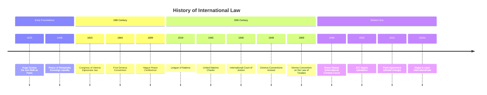

```mermaid
timeline
    title History of International Law
    section Early Foundations
      1625 : Hugo Grotius<br>De Jure Belli ac Pacis
      1648 : Peace of Westphalia<br>Sovereign equality
    section 19th Century
      1815 : Congress of Vienna<br>Diplomatic law
      1864 : First Geneva Convention
      1899 : Hague Peace Conference
    section 20th Century
      1919 : League of Nations
      1945 : United Nations Charter
      1946 : International Court of Justice
      1949 : Geneva Conventions revised
      1969 : Vienna Convention on the Law of Treaties
    section Modern Era
      1998 : Rome Statute<br>(International Criminal Court)
      2002 : ICC begins operations
      2015 : Paris Agreement<br>(climate change)
      2020s : Digital & cyber<br>international law
```
