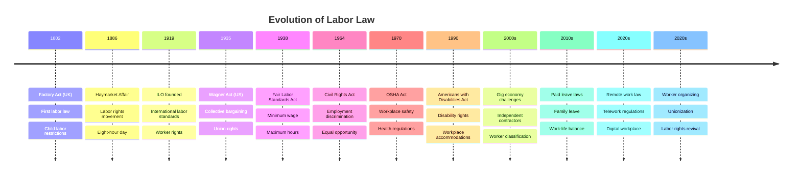

```mermaid
timeline
    title Evolution of Labor Law
    1802 : Factory Act (UK)
          : First labor law
          : Child labor restrictions
    1886 : Haymarket Affair
          : Labor rights movement
          : Eight-hour day
    1919 : ILO founded
          : International labor standards
          : Worker rights
    1935 : Wagner Act (US)
          : Collective bargaining
          : Union rights
    1938 : Fair Labor Standards Act
          : Minimum wage
          : Maximum hours
    1964 : Civil Rights Act
          : Employment discrimination
          : Equal opportunity
    1970 : OSHA Act
          : Workplace safety
          : Health regulations
    1990 : Americans with Disabilities Act
          : Disability rights
          : Workplace accommodations
    2000s : Gig economy challenges
          : Independent contractors
          : Worker classification
    2010s : Paid leave laws
          : Family leave
          : Work-life balance
    2020s : Remote work law
          : Telework regulations
          : Digital workplace
    2020s : Worker organizing
          : Unionization
          : Labor rights revival
```
