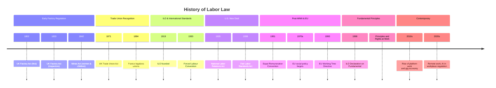

```mermaid
timeline
    title History of Labor Law
    section Early Factory Regulation
      1802 : UK Factory Act (first)
      1833 : UK Factory Act (inspectors)
      1842 : Mines Act (women & children)
    section Trade Union Recognition
      1871 : UK Trade Union Act
      1884 : France legalizes unions
    section ILO & International Standards
      1919 : ILO founded
      1930 : Forced Labour Convention
    section U.S. New Deal
      1935 : National Labor Relations Act
      1938 : Fair Labor Standards Act
    section Post‑WWII & EU
      1951 : Equal Remuneration Convention
      1970s : EU social policy begins
      1993 : EU Working Time Directive
    section Fundamental Principles
      1998 : ILO Declaration on Fundamental
      Principles and Rights at Work
    section Contemporary
      2010s : Rise of platform work<br>and gig economy
      2020s : Remote work, AI in<br>workplace regulation
```
