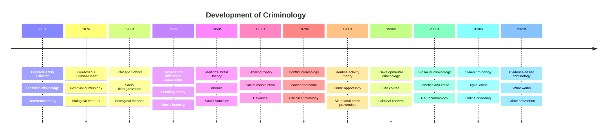

```mermaid
timeline
    title Development of Criminology
    1764 : Beccaria's "On Crimes"
          : Classical criminology
          : Deterrence theory
    1876 : Lombroso's "Criminal Man"
          : Positivist criminology
          : Biological theories
    1930s : Chicago School
          : Social disorganization
          : Ecological theories
    1939 : Sutherland's differential association
          : Learning theory
          : Social learning
    1950s : Merton's strain theory
          : Anomie
          : Social structure
    1960s : Labeling theory
          : Social construction
          : Deviance
    1970s : Conflict criminology
          : Power and crime
          : Critical criminology
    1980s : Routine activity theory
          : Crime opportunity
          : Situational crime prevention
    1990s : Developmental criminology
          : Life course
          : Criminal careers
    2000s : Biosocial criminology
          : Genetics and crime
          : Neurocriminology
    2010s : Cybercriminology
          : Digital crime
          : Online offending
    2020s : Evidence-based criminology
          : What works
          : Crime prevention
```
