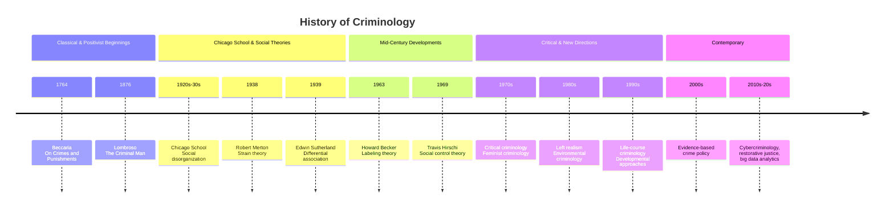

```mermaid
timeline
    title History of Criminology
    section Classical & Positivist Beginnings
      1764 : Beccaria<br>On Crimes and Punishments
      1876 : Lombroso<br>The Criminal Man
    section Chicago School & Social Theories
      1920s‑30s : Chicago School<br>Social disorganization
      1938 : Robert Merton<br>Strain theory
      1939 : Edwin Sutherland<br>Differential association
    section Mid‑Century Developments
      1963 : Howard Becker<br>Labeling theory
      1969 : Travis Hirschi<br>Social control theory
    section Critical & New Directions
      1970s : Critical criminology<br>Feminist criminology
      1980s : Left realism<br>Environmental criminology
      1990s : Life‑course criminology<br>Developmental approaches
    section Contemporary
      2000s : Evidence‑based<br>crime policy
      2010s‑20s : Cybercriminology,<br>restorative justice,<br>big data analytics
```
