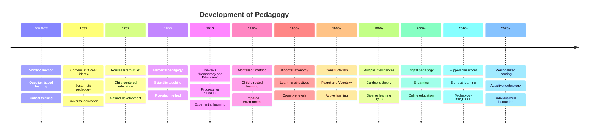

```mermaid
timeline
    title Development of Pedagogy
    400 BCE : Socratic method
          : Question-based learning
          : Critical thinking
    1632 : Comenius' "Great Didactic"
          : Systematic pedagogy
          : Universal education
    1762 : Rousseau's "Emile"
          : Child-centered education
          : Natural development
    1806 : Herbart's pedagogy
          : Scientific teaching
          : Five-step method
    1916 : Dewey's "Democracy and Education"
          : Progressive education
          : Experiential learning
    1920s : Montessori method
          : Child-directed learning
          : Prepared environment
    1950s : Bloom's taxonomy
          : Learning objectives
          : Cognitive levels
    1960s : Constructivism
          : Piaget and Vygotsky
          : Active learning
    1990s : Multiple intelligences
          : Gardner's theory
          : Diverse learning styles
    2000s : Digital pedagogy
          : E-learning
          : Online education
    2010s : Flipped classroom
          : Blended learning
          : Technology integration
    2020s : Personalized learning
          : Adaptive technology
          : Individualized instruction
```
