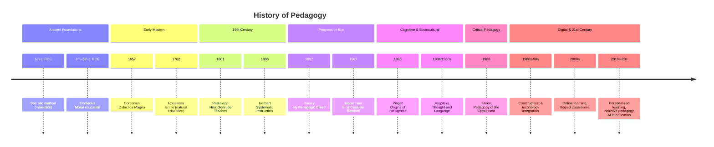

```mermaid
timeline
    title History of Pedagogy
    section Ancient Foundations
      5th c. BCE : Socratic method<br>(maieutics)
      6th–5th c. BCE : Confucius<br>Moral education
    section Early Modern
      1657 : Comenius<br>Didactica Magna
      1762 : Rousseau<br>Emile (natural education)
    section 19th Century
      1801 : Pestalozzi<br>How Gertrude Teaches
      1806 : Herbart<br>Systematic instruction
    section Progressive Era
      1897 : Dewey<br>My Pedagogic Creed
      1907 : Montessori<br>First Casa dei Bambini
    section Cognitive & Sociocultural
      1936 : Piaget<br>Origins of Intelligence
      1934/1960s : Vygotsky<br>Thought and Language
    section Critical Pedagogy
      1968 : Freire<br>Pedagogy of the Oppressed
    section Digital & 21st Century
      1980s‑90s : Constructivist &<br>technology integration
      2000s : Online learning,<br>flipped classrooms
      2010s‑20s : Personalized learning,<br>inclusive pedagogy, AI in education
```
