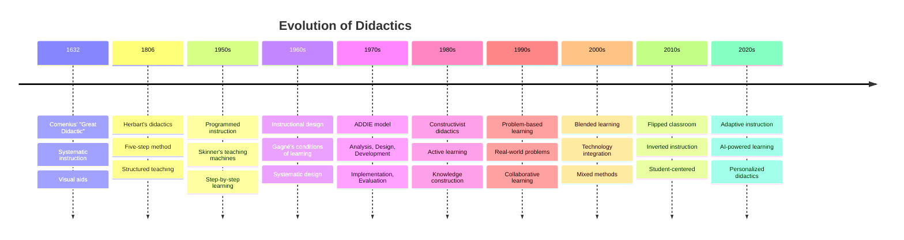

```mermaid
timeline
    title Evolution of Didactics
    1632 : Comenius' "Great Didactic"
          : Systematic instruction
          : Visual aids
    1806 : Herbart's didactics
          : Five-step method
          : Structured teaching
    1950s : Programmed instruction
          : Skinner's teaching machines
          : Step-by-step learning
    1960s : Instructional design
          : Gagné's conditions of learning
          : Systematic design
    1970s : ADDIE model
          : Analysis, Design, Development
          : Implementation, Evaluation
    1980s : Constructivist didactics
          : Active learning
          : Knowledge construction
    1990s : Problem-based learning
          : Real-world problems
          : Collaborative learning
    2000s : Blended learning
          : Technology integration
          : Mixed methods
    2010s : Flipped classroom
          : Inverted instruction
          : Student-centered
    2020s : Adaptive instruction
          : AI-powered learning
          : Personalized didactics
```
