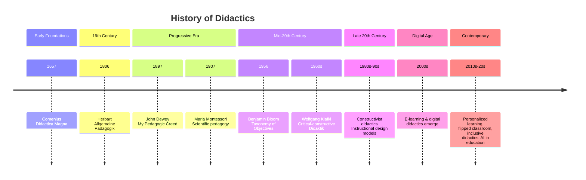

```mermaid
timeline
    title History of Didactics
    section Early Foundations
      1657 : Comenius<br>Didactica Magna
    section 19th Century
      1806 : Herbart<br>Allgemeine Pädagogik
    section Progressive Era
      1897 : John Dewey<br>My Pedagogic Creed
      1907 : Maria Montessori<br>Scientific pedagogy
    section Mid‑20th Century
      1956 : Benjamin Bloom<br>Taxonomy of Objectives
      1960s : Wolfgang Klafki<br>Critical‑constructive Didaktik
    section Late 20th Century
      1980s‑90s : Constructivist didactics<br>Instructional design models
    section Digital Age
      2000s : E‑learning & digital<br>didactics emerge
    section Contemporary
      2010s‑20s : Personalized learning,<br>flipped classroom, inclusive<br>didactics, AI in education
```
