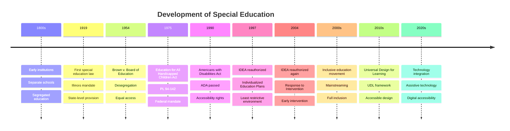

```mermaid
timeline
    title Development of Special Education
    1800s : Early institutions
          : Separate schools
          : Segregated education
    1919 : First special education law
          : Illinois mandate
          : State-level provision
    1954 : Brown v. Board of Education
          : Desegregation
          : Equal access
    1975 : Education for All Handicapped Children Act
          : PL 94-142
          : Federal mandate
    1990 : Americans with Disabilities Act
          : ADA passed
          : Accessibility rights
    1997 : IDEA reauthorized
          : Individualized Education Plans
          : Least restrictive environment
    2004 : IDEA reauthorized again
          : Response to Intervention
          : Early intervention
    2000s : Inclusive education movement
          : Mainstreaming
          : Full inclusion
    2010s : Universal Design for Learning
          : UDL framework
          : Accessible design
    2020s : Technology integration
          : Assistive technology
          : Digital accessibility
```
