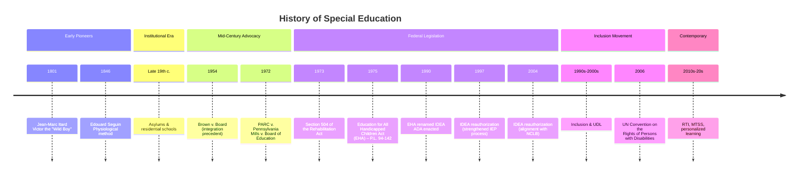

```mermaid
timeline
    title History of Special Education
    section Early Pioneers
      1801 : Jean‑Marc Itard<br>Victor the "Wild Boy"
      1846 : Edouard Seguin<br>Physiological method
    section Institutional Era
      Late 19th c. : Asylums &<br>residential schools
    section Mid‑Century Advocacy
      1954 : Brown v. Board<br>(integration precedent)
      1972 : PARC v. Pennsylvania<br>Mills v. Board of Education
    section Federal Legislation
      1973 : Section 504 of<br>the Rehabilitation Act
      1975 : Education for All<br>Handicapped Children Act<br>(EHA) – P.L. 94‑142
      1990 : EHA renamed IDEA<br>ADA enacted
      1997 : IDEA reauthorization<br>(strengthened IEP process)
      2004 : IDEA reauthorization<br>(alignment with NCLB)
    section Inclusion Movement
      1990s‑2000s : Inclusion & UDL
      2006 : UN Convention on the<br>Rights of Persons with Disabilities
    section Contemporary
      2010s‑20s : RTI, MTSS,<br>personalized learning
```
