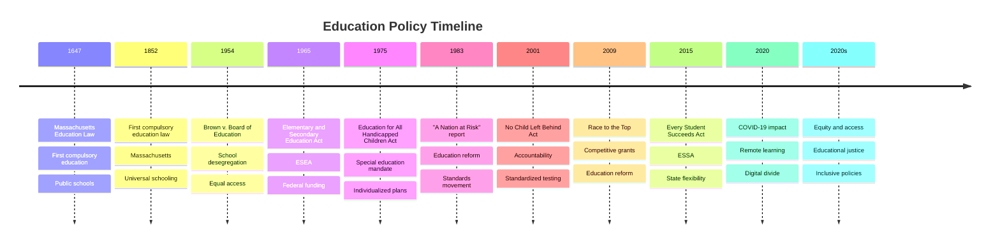

```mermaid
timeline
    title Education Policy Timeline
    1647 : Massachusetts Education Law
          : First compulsory education
          : Public schools
    1852 : First compulsory education law
          : Massachusetts
          : Universal schooling
    1954 : Brown v. Board of Education
          : School desegregation
          : Equal access
    1965 : Elementary and Secondary Education Act
          : ESEA
          : Federal funding
    1975 : Education for All Handicapped Children Act
          : Special education mandate
          : Individualized plans
    1983 : "A Nation at Risk" report
          : Education reform
          : Standards movement
    2001 : No Child Left Behind Act
          : Accountability
          : Standardized testing
    2009 : Race to the Top
          : Competitive grants
          : Education reform
    2015 : Every Student Succeeds Act
          : ESSA
          : State flexibility
    2020 : COVID-19 impact
          : Remote learning
          : Digital divide
    2020s : Equity and access
          : Educational justice
          : Inclusive policies
```
