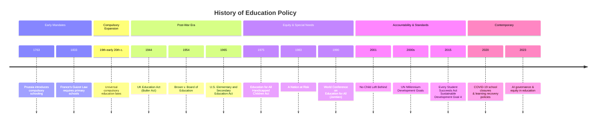

```mermaid
timeline
    title History of Education Policy
    section Early Mandates
      1763 : Prussia introduces<br>compulsory schooling
      1833 : France's Guizot Law<br>requires primary schools
    section Compulsory Expansion
      19th‑early 20th c. : Universal<br>compulsory education laws
    section Post‑War Era
      1944 : UK Education Act<br>(Butler Act)
      1954 : Brown v. Board of Education
      1965 : U.S. Elementary and<br>Secondary Education Act
    section Equity & Special Needs
      1975 : Education for All<br>Handicapped Children Act
      1983 : A Nation at Risk
      1990 : World Conference on<br>Education for All (Jomtien)
    section Accountability & Standards
      2001 : No Child Left Behind
      2000s : UN Millennium<br>Development Goals
      2015 : Every Student Succeeds Act<br>Sustainable Development Goal 4
    section Contemporary
      2020 : COVID‑19 school closures<br>& learning recovery policies
      2023 : AI governance &<br>equity in education
```
