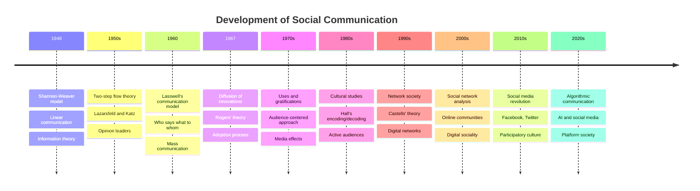

```mermaid
timeline
    title Development of Social Communication
    1948 : Shannon-Weaver model
          : Linear communication
          : Information theory
    1950s : Two-step flow theory
          : Lazarsfeld and Katz
          : Opinion leaders
    1960 : Lasswell's communication model
          : Who says what to whom
          : Mass communication
    1967 : Diffusion of innovations
          : Rogers' theory
          : Adoption process
    1970s : Uses and gratifications
          : Audience-centered approach
          : Media effects
    1980s : Cultural studies
          : Hall's encoding/decoding
          : Active audiences
    1990s : Network society
          : Castells' theory
          : Digital networks
    2000s : Social network analysis
          : Online communities
          : Digital sociality
    2010s : Social media revolution
          : Facebook, Twitter
          : Participatory culture
    2020s : Algorithmic communication
          : AI and social media
          : Platform society
```
