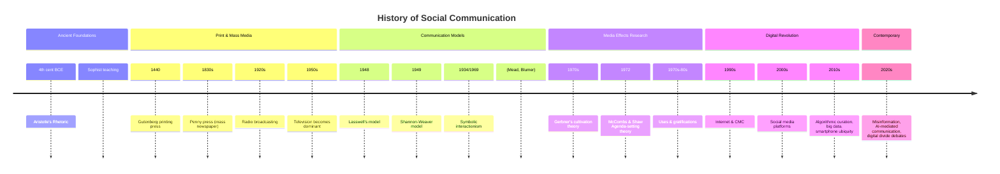

```mermaid
timeline
    title History of Social Communication
    section Ancient Foundations
      4th cent BCE : Aristotle's Rhetoric
      Sophist teaching
    section Print & Mass Media
      1440 : Gutenberg printing press
      1830s : Penny press (mass newspaper)
      1920s : Radio broadcasting
      1950s : Television becomes dominant
    section Communication Models
      1948 : Lasswell's model
      1949 : Shannon‑Weaver model
      1934/1969 : Symbolic interactionism
      (Mead, Blumer)
    section Media Effects Research
      1970s : Gerbner's cultivation theory
      1972 : McCombs & Shaw<br>Agenda‑setting theory
      1970s‑80s : Uses & gratifications
    section Digital Revolution
      1990s : Internet & CMC
      2000s : Social media platforms
      2010s : Algorithmic curation,<br>big data, smartphone ubiquity
    section Contemporary
      2020s : Misinformation,<br>AI‑mediated communication,<br>digital divide debates
```
