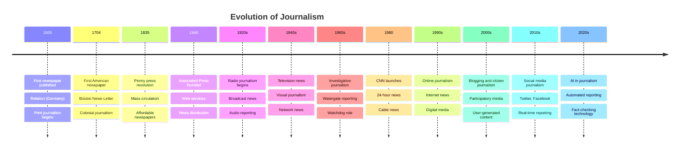

```mermaid
timeline
    title Evolution of Journalism
    1605 : First newspaper published
          : Relation (Germany)
          : Print journalism begins
    1704 : First American newspaper
          : Boston News-Letter
          : Colonial journalism
    1835 : Penny press revolution
          : Mass circulation
          : Affordable newspapers
    1848 : Associated Press founded
          : Wire services
          : News distribution
    1920s : Radio journalism begins
          : Broadcast news
          : Audio reporting
    1940s : Television news
          : Visual journalism
          : Network news
    1960s : Investigative journalism
          : Watergate reporting
          : Watchdog role
    1980 : CNN launches
          : 24-hour news
          : Cable news
    1990s : Online journalism
          : Internet news
          : Digital media
    2000s : Blogging and citizen journalism
          : Participatory media
          : User-generated content
    2010s : Social media journalism
          : Twitter, Facebook
          : Real-time reporting
    2020s : AI in journalism
          : Automated reporting
          : Fact-checking technology
```
