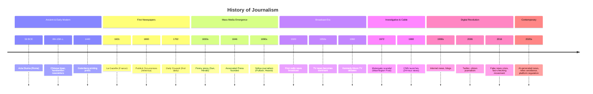

```mermaid
timeline
    title History of Journalism
    section Ancient & Early Modern
      59 BCE : Acta Diurna (Rome)
      8th‑15th c. : Chinese tipao,<br>handwritten newsletters
      1440 : Gutenberg printing press
    section First Newspapers
      1631 : La Gazette (France)
      1690 : Publick Occurrences (America)
      1702 : Daily Courant (first daily)
    section Mass Media Emergence
      1830s : Penny press (Sun, Herald)
      1846 : Associated Press founded
      1890s : Yellow journalism<br>(Pulitzer, Hearst)
    section Broadcast Era
      1920 : First radio news broadcast
      1950s : TV news becomes dominant
      1960 : Kennedy‑Nixon TV debates
    section Investigative & Cable
      1972 : Watergate scandal<br>(Washington Post)
      1980 : CNN launches (24‑hour news)
    section Digital Revolution
      1990s : Internet news, blogs
      2006 : Twitter, citizen journalism
      2016 : Fake news crisis,<br>fact‑checking movement
    section Contemporary
      2020s : AI‑generated news,<br>news avoidance, platform regulation
```
