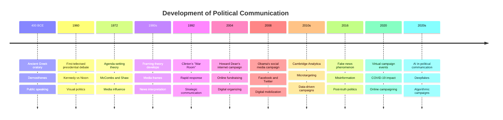

```mermaid
timeline
    title Development of Political Communication
    400 BCE : Ancient Greek oratory
          : Demosthenes
          : Public speaking
    1960 : First televised presidential debate
          : Kennedy vs Nixon
          : Visual politics
    1972 : Agenda-setting theory
          : McCombs and Shaw
          : Media influence
    1980s : Framing theory develops
          : Media frames
          : News interpretation
    1992 : Clinton's "War Room"
          : Rapid response
          : Strategic communication
    2004 : Howard Dean's internet campaign
          : Online fundraising
          : Digital organizing
    2008 : Obama's social media campaign
          : Facebook and Twitter
          : Digital mobilization
    2010s : Cambridge Analytica
          : Microtargeting
          : Data-driven campaigns
    2016 : Fake news phenomenon
          : Misinformation
          : Post-truth politics
    2020 : Virtual campaign events
          : COVID-19 impact
          : Online campaigning
    2020s : AI in political communication
          : Deepfakes
          : Algorithmic campaigns
```
