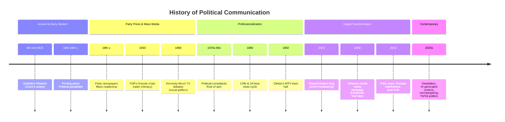

```mermaid
timeline
    title History of Political Communication
    section Ancient & Early Modern
      4th cent BCE : Aristotle's Rhetoric<br>Cicero's oratory
      16th‑18th c. : Printing press<br>Political pamphlets
    section Party Press & Mass Media
      19th c. : Party newspapers<br>Mass readership
      1933 : FDR's fireside chats<br>(radio intimacy)
      1960 : Kennedy‑Nixon TV debates<br>(visual politics)
    section Professionalization
      1970s‑80s : Political consultants<br>Rise of spin
      1980 : CNN & 24‑hour news cycle
      1992 : Clinton's MTV town hall
    section Digital Transformation
      2003 : Howard Dean's blog<br>(online fundraising)
      2008 : Obama's social media<br>campaign (Facebook, YouTube)
      2016 : Fake news, Russian<br>interference, post‑truth
    section Contemporary
      2020s : Deepfakes, AI‑generated<br>content, microtargeting,<br>TikTok politics
```
