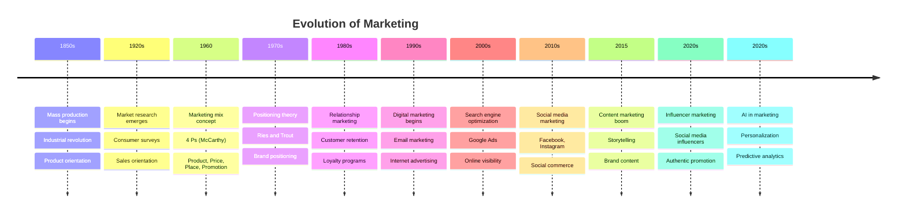

```mermaid
timeline
    title Evolution of Marketing
    1850s : Mass production begins
          : Industrial revolution
          : Product orientation
    1920s : Market research emerges
          : Consumer surveys
          : Sales orientation
    1960 : Marketing mix concept
          : 4 Ps (McCarthy)
          : Product, Price, Place, Promotion
    1970s : Positioning theory
          : Ries and Trout
          : Brand positioning
    1980s : Relationship marketing
          : Customer retention
          : Loyalty programs
    1990s : Digital marketing begins
          : Email marketing
          : Internet advertising
    2000s : Search engine optimization
          : Google Ads
          : Online visibility
    2010s : Social media marketing
          : Facebook, Instagram
          : Social commerce
    2015 : Content marketing boom
          : Storytelling
          : Brand content
    2020s : Influencer marketing
          : Social media influencers
          : Authentic promotion
    2020s : AI in marketing
          : Personalization
          : Predictive analytics
```
