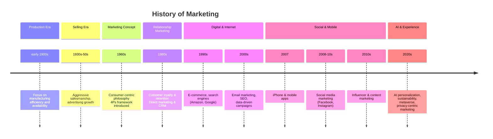

```mermaid
timeline
    title History of Marketing
    section Production Era
      early 1900s : Focus on manufacturing<br>efficiency and availability
    section Selling Era
      1930s‑50s : Aggressive salesmanship,<br>advertising growth
    section Marketing Concept
      1960s : Consumer‑centric philosophy<br>4Ps framework introduced
    section Relationship Marketing
      1980s : Customer loyalty & retention<br>Direct marketing & CRM
    section Digital & Internet
      1990s : E‑commerce, search engines<br>(Amazon, Google)
      2000s : Email marketing, SEO,<br>data‑driven campaigns
    section Social & Mobile
      2007 : iPhone & mobile apps
      2008‑10s : Social media marketing<br>(Facebook, Instagram)
      2010s : Influencer & content marketing
    section AI & Experience
      2020s : AI personalization,<br>sustainability, metaverse,<br>privacy‑centric marketing
```
