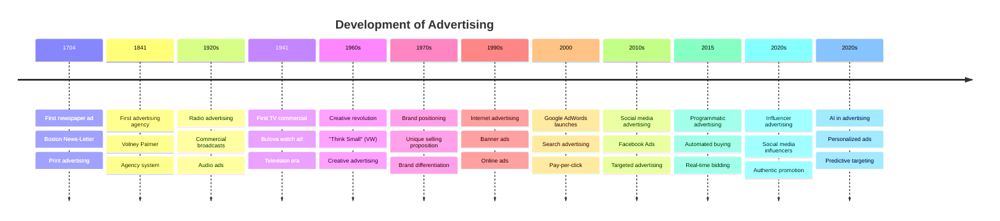

```mermaid
timeline
    title Development of Advertising
    1704 : First newspaper ad
          : Boston News-Letter
          : Print advertising
    1841 : First advertising agency
          : Volney Palmer
          : Agency system
    1920s : Radio advertising
          : Commercial broadcasts
          : Audio ads
    1941 : First TV commercial
          : Bulova watch ad
          : Television era
    1960s : Creative revolution
          : "Think Small" (VW)
          : Creative advertising
    1970s : Brand positioning
          : Unique selling proposition
          : Brand differentiation
    1990s : Internet advertising
          : Banner ads
          : Online ads
    2000 : Google AdWords launches
          : Search advertising
          : Pay-per-click
    2010s : Social media advertising
          : Facebook Ads
          : Targeted advertising
    2015 : Programmatic advertising
          : Automated buying
          : Real-time bidding
    2020s : Influencer advertising
          : Social media influencers
          : Authentic promotion
    2020s : AI in advertising
          : Personalized ads
          : Predictive targeting
```
