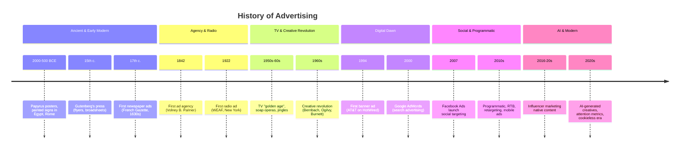

```mermaid
timeline
    title History of Advertising
    section Ancient & Early Modern
      2000‑500 BCE : Papyrus posters,<br>painted signs in Egypt, Rome
      15th c. : Gutenberg's press<br>(flyers, broadsheets)
      17th c. : First newspaper ads<br>(French Gazette, 1630s)
    section Agency & Radio
      1842 : First ad agency<br>(Volney B. Palmer)
      1922 : First radio ad<br>(WEAF, New York)
    section TV & Creative Revolution
      1950s‑60s : TV "golden age",<br>soap operas, jingles
      1960s : Creative revolution<br>(Bernbach, Ogilvy, Burnett)
    section Digital Dawn
      1994 : First banner ad<br>(AT&T on HotWired)
      2000 : Google AdWords<br>(search advertising)
    section Social & Programmatic
      2007 : Facebook Ads launch<br>social targeting
      2010s : Programmatic, RTB,<br>retargeting, mobile ads
    section AI & Modern
      2016‑20s : Influencer marketing<br>native content
      2020s : AI‑generated creatives,<br>attention metrics, cookieless era
```
