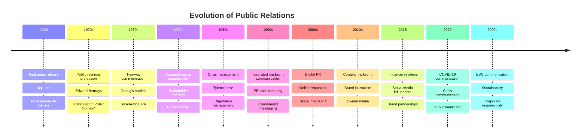

```mermaid
timeline
    title Evolution of Public Relations
    1906 : First press release
          : Ivy Lee
          : Professional PR begins
    1920s : Public relations profession
          : Edward Bernays
          : "Crystallizing Public Opinion"
    1950s : Two-way communication
          : Grunig's models
          : Symmetrical PR
    1960s : Corporate social responsibility
          : Stakeholder relations
          : Public interest
    1980s : Crisis management
          : Tylenol case
          : Reputation management
    1990s : Integrated marketing communication
          : PR and marketing
          : Coordinated messaging
    2000s : Digital PR
          : Online reputation
          : Social media PR
    2010s : Content marketing
          : Brand journalism
          : Owned media
    2015 : Influencer relations
          : Social media influencers
          : Brand partnerships
    2020 : COVID-19 communication
          : Crisis communication
          : Public health PR
    2020s : ESG communication
          : Sustainability
          : Corporate responsibility
```
