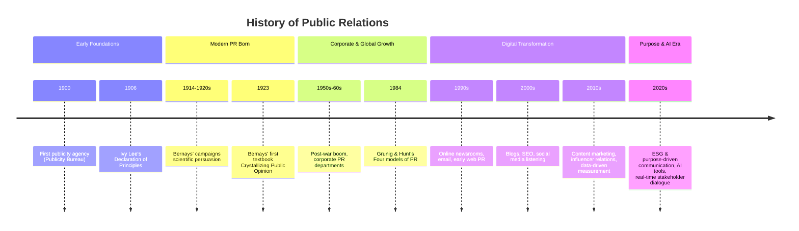

```mermaid
timeline
    title History of Public Relations
    section Early Foundations
      1900 : First publicity agency<br>(Publicity Bureau)
      1906 : Ivy Lee's<br>Declaration of Principles
    section Modern PR Born
      1914‑1920s : Bernays' campaigns<br>scientific persuasion
      1923 : Bernays' first textbook<br>Crystallizing Public Opinion
    section Corporate & Global Growth
      1950s‑60s : Post‑war boom,<br>corporate PR departments
      1984 : Grunig & Hunt's<br>Four models of PR
    section Digital Transformation
      1990s : Online newsrooms,<br>email, early web PR
      2000s : Blogs, SEO, social<br>media listening
      2010s : Content marketing,<br>influencer relations,<br>data‑driven measurement
    section Purpose & AI Era
      2020s : ESG & purpose‑driven<br>communication, AI tools,<br>real‑time stakeholder dialogue
```
