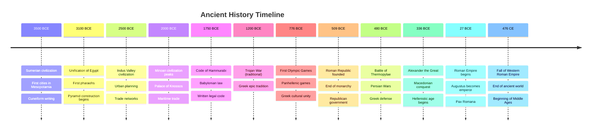

```mermaid
timeline
    title Ancient History Timeline
    3500 BCE : Sumerian civilization
          : First cities in Mesopotamia
          : Cuneiform writing
    3100 BCE : Unification of Egypt
          : First pharaohs
          : Pyramid construction begins
    2500 BCE : Indus Valley civilization
          : Urban planning
          : Trade networks
    2000 BCE : Minoan civilization peaks
          : Palace of Knossos
          : Maritime trade
    1750 BCE : Code of Hammurabi
          : Babylonian law
          : Written legal code
    1200 BCE : Trojan War (traditional)
          : Greek epic tradition
    776 BCE : First Olympic Games
          : Panhellenic games
          : Greek cultural unity
    509 BCE : Roman Republic founded
          : End of monarchy
          : Republican government
    480 BCE : Battle of Thermopylae
          : Persian Wars
          : Greek defense
    336 BCE : Alexander the Great
          : Macedonian conquest
          : Hellenistic age begins
    27 BCE : Roman Empire begins
          : Augustus becomes emperor
          : Pax Romana
    476 CE : Fall of Western Roman Empire
          : End of ancient world
          : Beginning of Middle Ages
```
