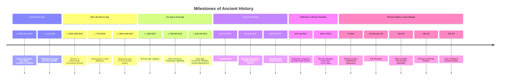

```mermaid
timeline
    title Milestones of Ancient History
    section Early Bronze Age
      c. 3500‑3000 BCE : Rise of Sumerian city‑states,<br>invention of writing
      c. 3100 BCE : Unification of Egypt<br>(Narmer palette)
    section Mid‑Late Bronze Age
      c. 2000‑1600 BCE : Minoan & Mycenaean<br>civilizations flourish
      c. 1754 BCE : Hammurabi's Code<br>(Babylon)
      c. 1600‑1046 BCE : Shang Dynasty<br>in China (oracle bones)
    section Iron Age & Axial Age
      c. 1200 BCE : Bronze Age collapse
      c. 900‑600 BCE : Rise of Assyria,<br>Phoenician alphabet
      c. 600‑400 BCE : Axial Age:<br>Confucius, Buddha, Greek philosophers
    section Classical Antiquity
      490‑479 BCE : Persian Wars
      5th cent BCE : Athenian democracy,<br>Golden Age of Greece
      336‑323 BCE : Alexander the Great's empire
    section Hellenistic & Roman Republic
      323‑146 BCE : Hellenistic kingdoms<br>spread Greek culture
      509‑27 BCE : Roman Republic expansion,<br>Punic Wars
    section Roman Empire & Late Antiquity
      27 BCE : Roman Empire established<br>(Augustus)
      1st‑2nd cent CE : Pax Romana
      313 CE : Edict of Milan<br>(Christianity tolerated)
      395 CE : Division of Roman Empire
      476 CE : Fall of Western Roman Empire
```
