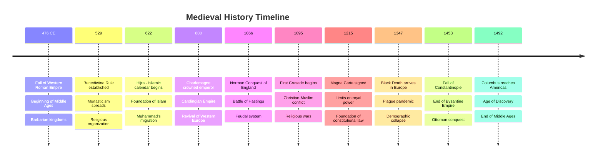

```mermaid
timeline
    title Medieval History Timeline
    476 CE : Fall of Western Roman Empire
          : Beginning of Middle Ages
          : Barbarian kingdoms
    529 : Benedictine Rule established
          : Monasticism spreads
          : Religious organization
    622 : Hijra - Islamic calendar begins
          : Foundation of Islam
          : Muhammad's migration
    800 : Charlemagne crowned emperor
          : Carolingian Empire
          : Revival of Western Europe
    1066 : Norman Conquest of England
          : Battle of Hastings
          : Feudal system
    1095 : First Crusade begins
          : Christian-Muslim conflict
          : Religious wars
    1215 : Magna Carta signed
          : Limits on royal power
          : Foundation of constitutional law
    1347 : Black Death arrives in Europe
          : Plague pandemic
          : Demographic collapse
    1453 : Fall of Constantinople
          : End of Byzantine Empire
          : Ottoman conquest
    1492 : Columbus reaches Americas
          : Age of Discovery
          : End of Middle Ages
```
