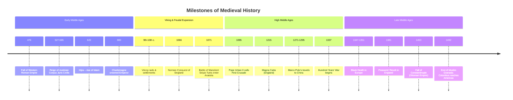

```mermaid
timeline
    title Milestones of Medieval History
    section Early Middle Ages
      476 : Fall of Western Roman Empire
      527‑565 : Reign of Justinian<br>Corpus Juris Civilis
      622 : Hijra – rise of Islam
      800 : Charlemagne crowned Emperor
    section Viking & Feudal Expansion
      9th‑10th c. : Viking raids & settlements
      1066 : Norman Conquest of England
      1071 : Battle of Manzikert<br>Seljuk Turks enter Anatolia
    section High Middle Ages
      1095 : Pope Urban II calls<br>First Crusade
      1215 : Magna Carta (England)
      1271‑1295 : Marco Polo's travels to China
      1337 : Hundred Years' War begins
    section Late Middle Ages
      1347‑1351 : Black Death in Europe
      1381 : Peasants' Revolt in England
      1453 : Fall of Constantinople<br>(Ottoman Empire)
      1492 : End of Muslim Granada;<br>Columbus reaches Americas
```
