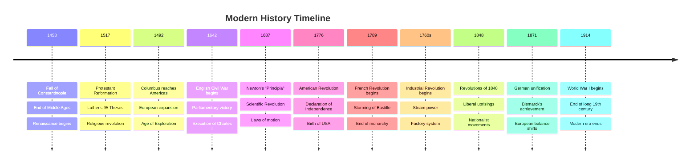

```mermaid
timeline
    title Modern History Timeline
    1453 : Fall of Constantinople
          : End of Middle Ages
          : Renaissance begins
    1517 : Protestant Reformation
          : Luther's 95 Theses
          : Religious revolution
    1492 : Columbus reaches Americas
          : European expansion
          : Age of Exploration
    1642 : English Civil War begins
          : Parliamentary victory
          : Execution of Charles I
    1687 : Newton's "Principia"
          : Scientific Revolution
          : Laws of motion
    1776 : American Revolution
          : Declaration of Independence
          : Birth of USA
    1789 : French Revolution begins
          : Storming of Bastille
          : End of monarchy
    1760s : Industrial Revolution begins
          : Steam power
          : Factory system
    1848 : Revolutions of 1848
          : Liberal uprisings
          : Nationalist movements
    1871 : German unification
          : Bismarck's achievement
          : European balance shifts
    1914 : World War I begins
          : End of long 19th century
          : Modern era ends
```
