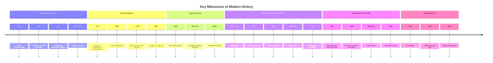

```mermaid
timeline
    title Key Milestones of Modern History
    section Early Modern Transitions
      1453 : Fall of Constantinople
      1492 : Columbus reaches Americas
      1517 : Protestant Reformation begins
      1642‑1651 : English Civil War
    section Age of Revolutions
      1776 : American Declaration of Independence
      1789 : French Revolution
      c. 1780 : Industrial Revolution in Britain
      1815 : Congress of Vienna
    section Long 19th Century
      1848 : Year of Revolutions
      1861‑1871 : Unification of Italy & Germany
      1880s : Scramble for Africa
    section World Wars & Ideological Conflict
      1914‑1918 : World War I
      1917 : Russian Revolution
      1929 : Great Depression
      1939‑1945 : World War II
      1945 : United Nations founded
    section Decolonisation & Cold War
      1947 : Independence of India & Pakistan
      1949 : Chinese Communist Revolution
      1955‑1975 : Vietnam War
      1989 : Fall of Berlin Wall
    section Contemporary Era
      2001 : 9/11 attacks
      2008 : Global financial crisis
      2020 : COVID‑19 pandemic
```
