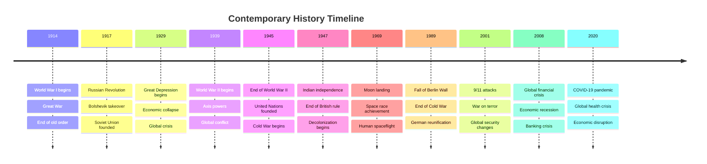

```mermaid
timeline
    title Contemporary History Timeline
    1914 : World War I begins
          : Great War
          : End of old order
    1917 : Russian Revolution
          : Bolshevik takeover
          : Soviet Union founded
    1929 : Great Depression begins
          : Economic collapse
          : Global crisis
    1939 : World War II begins
          : Axis powers
          : Global conflict
    1945 : End of World War II
          : United Nations founded
          : Cold War begins
    1947 : Indian independence
          : End of British rule
          : Decolonization begins
    1969 : Moon landing
          : Space race achievement
          : Human spaceflight
    1989 : Fall of Berlin Wall
          : End of Cold War
          : German reunification
    2001 : 9/11 attacks
          : War on terror
          : Global security changes
    2008 : Global financial crisis
          : Economic recession
          : Banking crisis
    2020 : COVID-19 pandemic
          : Global health crisis
          : Economic disruption
```
