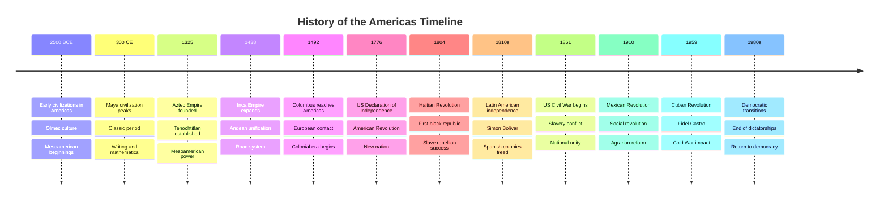

```mermaid
timeline
    title History of the Americas Timeline
    2500 BCE : Early civilizations in Americas
          : Olmec culture
          : Mesoamerican beginnings
    300 CE : Maya civilization peaks
          : Classic period
          : Writing and mathematics
    1325 : Aztec Empire founded
          : Tenochtitlan established
          : Mesoamerican power
    1438 : Inca Empire expands
          : Andean unification
          : Road system
    1492 : Columbus reaches Americas
          : European contact
          : Colonial era begins
    1776 : US Declaration of Independence
          : American Revolution
          : New nation
    1804 : Haitian Revolution
          : First black republic
          : Slave rebellion success
    1810s : Latin American independence
          : Simón Bolívar
          : Spanish colonies freed
    1861 : US Civil War begins
          : Slavery conflict
          : National unity
    1910 : Mexican Revolution
          : Social revolution
          : Agrarian reform
    1959 : Cuban Revolution
          : Fidel Castro
          : Cold War impact
    1980s : Democratic transitions
          : End of dictatorships
          : Return to democracy
```
