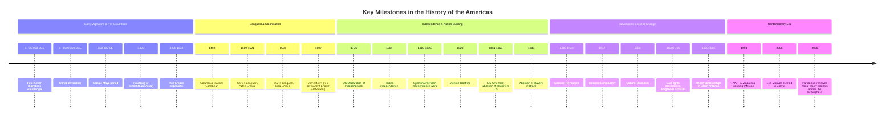

```mermaid
timeline
    title Key Milestones in the History of the Americas
    section Early Migrations & Pre‑Columbian
      c. 20,000 BCE : First human migrations<br>via Beringia
      c. 1500‑300 BCE : Olmec civilisation
      250‑900 CE : Classic Maya period
      1325 : Founding of Tenochtitlan (Aztec)
      1438‑1533 : Inca Empire expansion
    section Conquest & Colonisation
      1492 : Columbus reaches Caribbean
      1519‑1521 : Cortés conquers Aztec Empire
      1532 : Pizarro conquers Inca Empire
      1607 : Jamestown (first permanent English settlement)
    section Independence & Nation‑Building
      1776 : US Declaration of Independence
      1804 : Haitian independence
      1810‑1825 : Spanish American independence wars
      1823 : Monroe Doctrine
      1861‑1865 : US Civil War; abolition of slavery in US
      1888 : Abolition of slavery in Brazil
    section Revolutions & Social Change
      1910‑1920 : Mexican Revolution
      1917 : Mexican Constitution
      1959 : Cuban Revolution
      1960s‑70s : Civil rights movements; indigenous activism
      1970s‑80s : Military dictatorships in South America
    section Contemporary Era
      1994 : NAFTA; Zapatista uprising (Mexico)
      2006 : Evo Morales elected in Bolivia
      2020 : Pandemic; renewed racial equity protests<br>across the hemisphere
```
