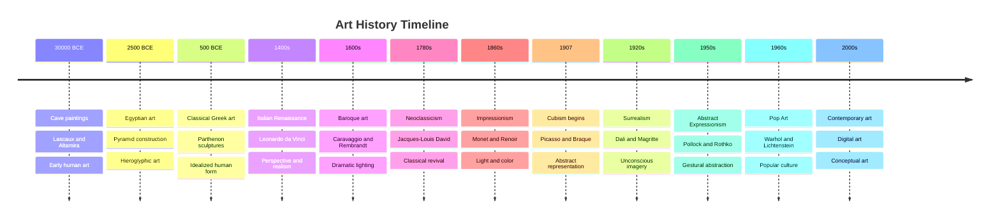

```mermaid
timeline
    title Art History Timeline
    30000 BCE : Cave paintings
          : Lascaux and Altamira
          : Early human art
    2500 BCE : Egyptian art
          : Pyramid construction
          : Hieroglyphic art
    500 BCE : Classical Greek art
          : Parthenon sculptures
          : Idealized human form
    1400s : Italian Renaissance
          : Leonardo da Vinci
          : Perspective and realism
    1600s : Baroque art
          : Caravaggio and Rembrandt
          : Dramatic lighting
    1780s : Neoclassicism
          : Jacques-Louis David
          : Classical revival
    1860s : Impressionism
          : Monet and Renoir
          : Light and color
    1907 : Cubism begins
          : Picasso and Braque
          : Abstract representation
    1920s : Surrealism
          : Dali and Magritte
          : Unconscious imagery
    1950s : Abstract Expressionism
          : Pollock and Rothko
          : Gestural abstraction
    1960s : Pop Art
          : Warhol and Lichtenstein
          : Popular culture
    2000s : Contemporary art
          : Digital art
          : Conceptual art
```
