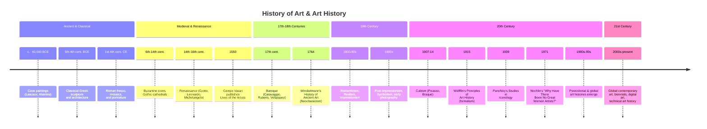

```mermaid
timeline
    title History of Art & Art History
    section Ancient & Classical
      c. 40,000 BCE : Cave paintings<br>(Lascaux, Altamira)
      5th‑4th cent. BCE : Classical Greek sculpture<br>and architecture
      1st‑4th cent. CE : Roman fresco, mosaics,<br>and portraiture
    section Medieval & Renaissance
      6th‑14th cent. : Byzantine icons,<br>Gothic cathedrals
      14th‑16th cent. : Renaissance (Giotto,<br>Leonardo, Michelangelo)
      1550 : Giorgio Vasari publishes<br>Lives of the Artists
    section 17th‑18th Centuries
      17th cent. : Baroque (Caravaggio,<br>Rubens, Velázquez)
      1764 : Winckelmann's History of<br>Ancient Art (Neoclassicism)
    section 19th Century
      1800‑80s : Romanticism, Realism,<br>Impressionism
      1890s : Post‑Impressionism,<br>Symbolism, early photography
    section 20th Century
      1907‑14 : Cubism (Picasso, Braque)
      1915 : Wölfflin's Principles of<br>Art History (formalism)
      1939 : Panofsky's Studies in<br>Iconology
      1971 : Nochlin's "Why Have There<br>Been No Great Women Artists?"
      1980s‑90s : Postcolonial & global<br>art histories emerge
    section 21st Century
      2000s‑present : Global contemporary<br>art, biennials, digital art,<br>technical art history
```
