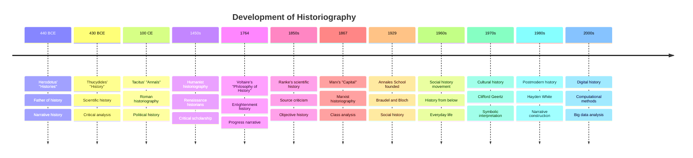

```mermaid
timeline
    title Development of Historiography
    440 BCE : Herodotus' "Histories"
          : Father of history
          : Narrative history
    430 BCE : Thucydides' "History"
          : Scientific history
          : Critical analysis
    100 CE : Tacitus' "Annals"
          : Roman historiography
          : Political history
    1450s : Humanist historiography
          : Renaissance historians
          : Critical scholarship
    1764 : Voltaire's "Philosophy of History"
          : Enlightenment history
          : Progress narrative
    1850s : Ranke's scientific history
          : Source criticism
          : Objective history
    1867 : Marx's "Capital"
          : Marxist historiography
          : Class analysis
    1929 : Annales School founded
          : Braudel and Bloch
          : Social history
    1960s : Social history movement
          : History from below
          : Everyday life
    1970s : Cultural history
          : Clifford Geertz
          : Symbolic interpretation
    1980s : Postmodern history
          : Hayden White
          : Narrative construction
    2000s : Digital history
          : Computational methods
          : Big data analysis
```
