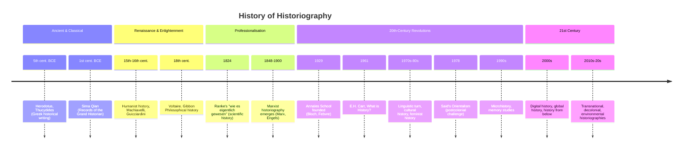

```mermaid
timeline
    title History of Historiography
    section Ancient & Classical
      5th cent. BCE : Herodotus, Thucydides<br>(Greek historical writing)
      1st cent. BCE : Sima Qian<br>(Records of the Grand Historian)
    section Renaissance & Enlightenment
      15th‑16th cent. : Humanist history,<br>Machiavelli, Guicciardini
      18th cent. : Voltaire, Gibbon<br>Philosophical history
    section Professionalisation
      1824 : Ranke's "wie es eigentlich<br>gewesen" (scientific history)
      1848‑1900 : Marxist historiography<br>emerges (Marx, Engels)
    section 20th‑Century Revolutions
      1929 : Annales School founded<br>(Bloch, Febvre)
      1961 : E.H. Carr, What is History?
      1970s‑80s : Linguistic turn, cultural<br>history, feminist history
      1978 : Said's Orientalism<br>(postcolonial challenge)
      1990s : Microhistory, memory studies
    section 21st Century
      2000s : Digital history, global<br>history, history from below
      2010s‑20s : Transnational,<br>decolonial, environmental<br>historiographies
```
