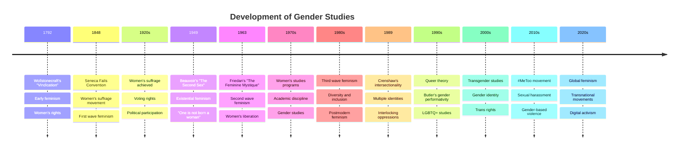

```mermaid
timeline
    title Development of Gender Studies
    1792 : Wollstonecraft's "Vindication"
          : Early feminism
          : Women's rights
    1848 : Seneca Falls Convention
          : Women's suffrage movement
          : First wave feminism
    1920s : Women's suffrage achieved
          : Voting rights
          : Political participation
    1949 : Beauvoir's "The Second Sex"
          : Existential feminism
          : "One is not born a woman"
    1963 : Friedan's "The Feminine Mystique"
          : Second wave feminism
          : Women's liberation
    1970s : Women's studies programs
          : Academic discipline
          : Gender studies
    1980s : Third wave feminism
          : Diversity and inclusion
          : Postmodern feminism
    1989 : Crenshaw's intersectionality
          : Multiple identities
          : Interlocking oppressions
    1990s : Queer theory
          : Butler's gender performativity
          : LGBTQ+ studies
    2000s : Transgender studies
          : Gender identity
          : Trans rights
    2010s : #MeToo movement
          : Sexual harassment
          : Gender-based violence
    2020s : Global feminism
          : Transnational movements
          : Digital activism
```
