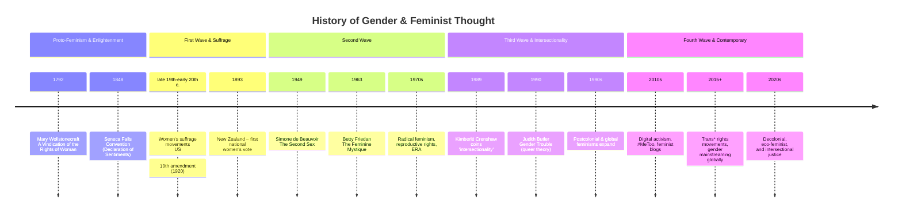

```mermaid
timeline
    title History of Gender & Feminist Thought
    section Proto‑Feminism & Enlightenment
      1792 : Mary Wollstonecraft<br>A Vindication of the Rights of Woman
      1848 : Seneca Falls Convention<br>(Declaration of Sentiments)
    section First Wave & Suffrage
      late 19th‑early 20th c. : Women's suffrage movements<br>US: 19th amendment (1920)
      1893 : New Zealand – first national<br>women's vote
    section Second Wave
      1949 : Simone de Beauvoir<br>The Second Sex
      1963 : Betty Friedan<br>The Feminine Mystique
      1970s : Radical feminism,<br>reproductive rights, ERA
    section Third Wave & Intersectionality
      1989 : Kimberlé Crenshaw<br>coins 'intersectionality'
      1990 : Judith Butler<br>Gender Trouble (queer theory)
      1990s : Postcolonial & global<br>feminisms expand
    section Fourth Wave & Contemporary
      2010s : Digital activism,<br>#MeToo, feminist blogs
      2015+ : Trans* rights movements,<br>gender mainstreaming globally
      2020s : Decolonial, eco‑feminist,<br>and intersectional justice
```
