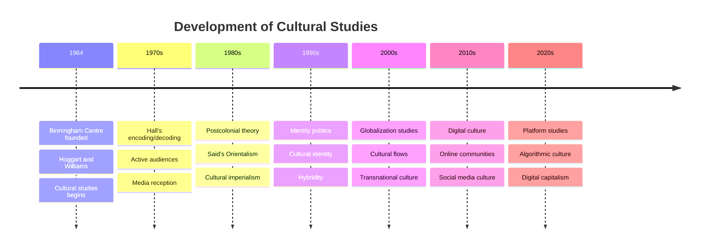

```mermaid
timeline
    title Development of Cultural Studies
    1964 : Birmingham Centre founded
          : Hoggart and Williams
          : Cultural studies begins
    1970s : Hall's encoding/decoding
          : Active audiences
          : Media reception
    1980s : Postcolonial theory
          : Said's Orientalism
          : Cultural imperialism
    1990s : Identity politics
          : Cultural identity
          : Hybridity
    2000s : Globalization studies
          : Cultural flows
          : Transnational culture
    2010s : Digital culture
          : Online communities
          : Social media culture
    2020s : Platform studies
          : Algorithmic culture
          : Digital capitalism
```
