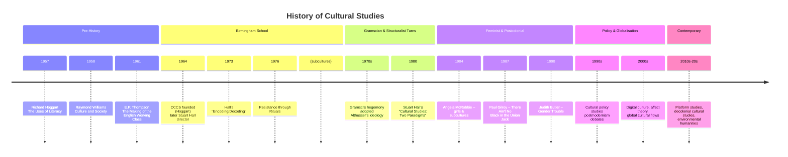

```mermaid
timeline
    title History of Cultural Studies
    section Pre‑History
      1957 : Richard Hoggart<br>The Uses of Literacy
      1958 : Raymond Williams<br>Culture and Society
      1961 : E.P. Thompson<br>The Making of the English Working Class
    section Birmingham School
      1964 : CCCS founded (Hoggart)<br>later Stuart Hall director
      1973 : Hall's "Encoding/Decoding"
      1976 : Resistance through Rituals
      (subcultures)
    section Gramscian & Structuralist Turns
      1970s : Gramsci's hegemony adopted<br>Althusser's ideology
      1980 : Stuart Hall's "Cultural Studies:<br>Two Paradigms"
    section Feminist & Postcolonial
      1984 : Angela McRobbie – girls &<br>subcultures
      1987 : Paul Gilroy – There Ain't No<br>Black in the Union Jack
      1990 : Judith Butler – Gender Trouble
    section Policy & Globalisation
      1990s : Cultural policy studies<br>postmodernism debates
      2000s : Digital culture, affect theory,<br>global cultural flows
    section Contemporary
      2010s‑20s : Platform studies,<br>decolonial cultural studies,<br>environmental humanities
```
