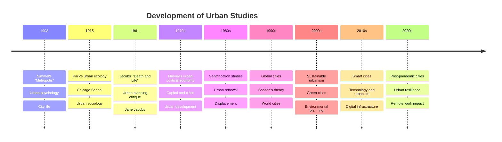

```mermaid
timeline
    title Development of Urban Studies
    1903 : Simmel's "Metropolis"
          : Urban psychology
          : City life
    1915 : Park's urban ecology
          : Chicago School
          : Urban sociology
    1961 : Jacobs' "Death and Life"
          : Urban planning critique
          : Jane Jacobs
    1970s : Harvey's urban political economy
          : Capital and cities
          : Urban development
    1980s : Gentrification studies
          : Urban renewal
          : Displacement
    1990s : Global cities
          : Sassen's theory
          : World cities
    2000s : Sustainable urbanism
          : Green cities
          : Environmental planning
    2010s : Smart cities
          : Technology and urbanism
          : Digital infrastructure
    2020s : Post-pandemic cities
          : Urban resilience
          : Remote work impact
```
