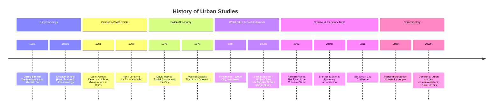

```mermaid
timeline
    title History of Urban Studies
    section Early Sociology
      1903 : Georg Simmel<br>The Metropolis and Mental Life
      1920s : Chicago School (Park, Burgess)<br>Urban ecology
    section Critiques of Modernism
      1961 : Jane Jacobs<br>Death and Life of Great American Cities
      1968 : Henri Lefebvre<br>Le Droit à la Ville
    section Political Economy
      1973 : David Harvey<br>Social Justice and the City
      1977 : Manuel Castells<br>The Urban Question
    section World Cities & Postmodernism
      1986 : Friedmann – World City hypothesis
      1990s : Saskia Sassen – Global Cities<br>Los Angeles School (Soja, Dear)
    section Creative & Planetary Turns
      2002 : Richard Florida<br>The Rise of the Creative Class
      2010s : Brenner & Schmid<br>Planetary urbanization
      2011 : IBM Smart City Challenge
    section Contemporary
      2020 : Pandemic urbanism<br>streets for people
      2022+ : Decolonial urban studies<br>climate resilience, 15‑minute city
```
