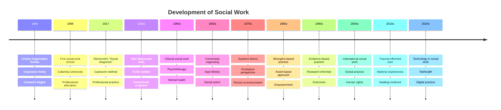

```mermaid
timeline
    title Development of Social Work
    1869 : Charity Organization Society
          : Organized charity
          : Casework begins
    1898 : First social work school
          : Columbia University
          : Professional education
    1917 : Richmond's "Social Diagnosis"
          : Casework method
          : Professional practice
    1930s : New Deal social work
          : Public welfare
          : Government programs
    1950s : Clinical social work
          : Psychotherapy
          : Mental health
    1960s : Community organizing
          : Saul Alinsky
          : Social action
    1970s : Systems theory
          : Ecological perspective
          : Person-in-environment
    1980s : Strengths-based practice
          : Asset-based approach
          : Empowerment
    1990s : Evidence-based practice
          : Research-informed
          : Outcomes
    2000s : International social work
          : Global practice
          : Human rights
    2010s : Trauma-informed care
          : Adverse experiences
          : Healing-centered
    2020s : Technology in social work
          : Telehealth
          : Digital practice
```
