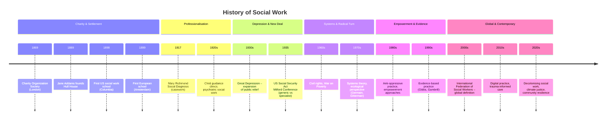

```mermaid
timeline
    title History of Social Work
    section Charity & Settlement
      1869 : Charity Organization Society<br>(London)
      1889 : Jane Addams founds Hull House
      1898 : First US social work school<br>(Columbia)
      1899 : First European school<br>(Amsterdam)
    section Professionalisation
      1917 : Mary Richmond<br>Social Diagnosis (casework)
      1920s : Child guidance clinics,<br>psychiatric social work
    section Depression & New Deal
      1930s : Great Depression – expansion<br>of public relief
      1935 : US Social Security Act<br>Milford Conference (generic vs specialist)
    section Systems & Radical Turn
      1960s : Civil rights, War on Poverty
      1970s : Systems theory, ecological<br>perspective (Germain, Gitterman)
    section Empowerment & Evidence
      1980s : Anti‑oppressive practice,<br>empowerment approaches
      1990s : Evidence‑based practice<br>(Gibbs, Gambrill)
    section Global & Contemporary
      2000s : International Federation of<br>Social Workers – global definition
      2010s : Digital practice,<br>trauma‑informed care
      2020s : Decolonising social work,<br>climate justice, community resilience
```
